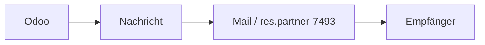
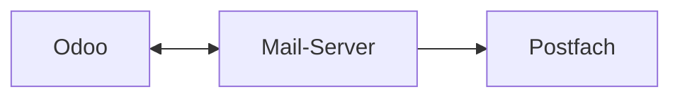
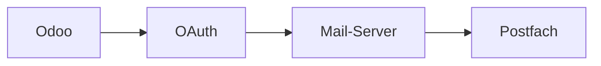
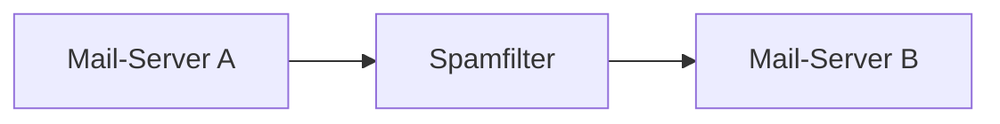
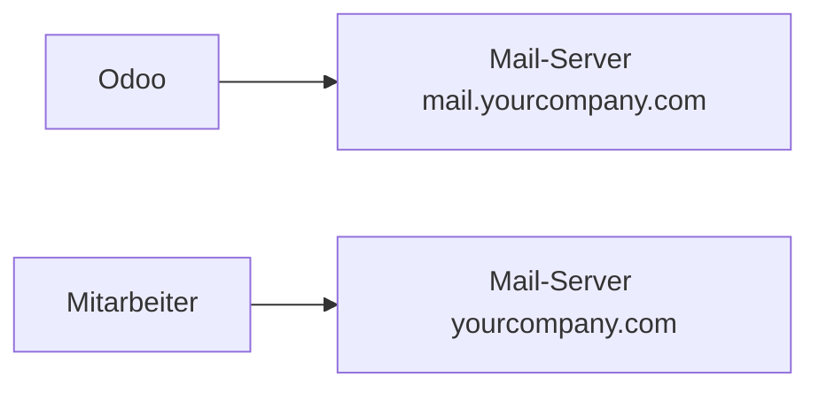
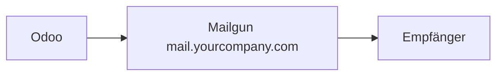
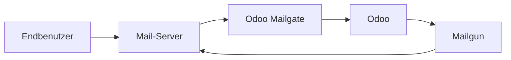

---
tags:
  - Blog
kind:
  - explain
draft: false
section: blog
---
# E-Mails mit Odoo versenden und empfangen

> Alles zur Mail-Integration mit Odoo.

Odoo bietet die Möglichkeit, E-Mails direkt zu versenden und zu empfangen. Wird eine Nachricht über den Odoo-Chatter versendet, versieht Odoo die E-Mail mit einer Kennzeichnung (Mail-Header). Antwortet der Empfänger auf diese E-Mail, erkennt Odoo anhand dieser Kennzeichnung die zugehörige Konversation und fügt die Antwort im Chatter zu.

Damit diese Art der E-Mail-Kommunikation funktioniert, muss Odoo in der Lage sein, E-Mails im Namen einer bestimmten Mail-Domain (z. B. `yourcompany.com`) zu versenden. Standardmässig erfolgt die Integration über ein vorhandenes E-Mail-Postfach. Odoo erhält Zugriff auf ein festgelegtes Postfach, beispielsweise `odoo@yourcompany.com`, und kann damit E-Mails senden, empfangen und verarbeiten.

Was zunächst einfach klingt, wird bei bestimmten Mail-Providern – insbesondere Microsoft 365 und Google Gmail – schnell komplex. Diese Anbieter erlauben keine klassische Authentifizierung über Benutzername und Passwort. Stattdessen muss Odoo als sogenannte OAuth-App registriert werden. Erst dann gestatten Microsoft oder Google den Zugriff auf bestimmte Ressourcen wie SMTP für den Versand und IMAP für den Empfang von E-Mails.

Diese OAuth-basierten Autorisierungsverfahren sind erfahrungsgemäss fehleranfällig und unterliegen häufigen Änderungen durch die Anbieter. Die direkte Integration eines E-Mail-Postfachs gestaltet sich dadurch unnötig kompliziert. Zum Glück gibt es alternative und deutlich einfachere Möglichkeiten, um E-Mails mit Odoo zu versenden und zu empfangen. Bevor wir darauf eingehen, lohnt sich ein Blick auf die verschiedenen Arten von E-Mails.

## Mail-Domains und Reputation

Wenn Sie E-Mails aus einem persönlichen geschäftlichen Postfach versenden, handelt es sich in der Regel um Geschäftskommunikation – meist unter der Domain `yourcompany.com`. Diese Mail-Domain besitzt im E-Mail-Verkehr eine Reputation. Diese ist schwierig zu messen, aber sehr entscheidend. Viele Mail-Server setzen Spamfilter ein, die auf der Reputation der Absender-Domain basieren.

Wenn Sie neben geschäftlicher Kommunikation auch Marketing-E-Mails versenden oder z. B. automatische Bestellbestätigungen aus einem Webshop heraus, erhöht sich das Versandvolumen deutlich. Solche E-Mails werden als **Marketing-Mails** bzw. **Transaktions-Mails** bezeichnet – und sie haben ein höheres Risiko, als Spam eingestuft zu werden. Werden diese Mails über dieselbe Domain wie die Geschäftskommunikation verschickt, kann dies die Reputation der Domain nachhaltig schädigen.

In der Praxis empfiehlt es sich daher, geschäftliche E-Mails und transaktionale E-Mails strikt zu trennen – idealerweise über unterschiedliche Mail-Domains. Um dies zu erreichen, sollte das E-Mail-Volumen für transaktionale Mails über eine separate Domain laufen. In unserem Beispiel nutzen wir für Odoo-Kommunikation nicht `yourcompany.com`, sondern `mail.yourcompany.com`.

## Mailgun und Odoo Mailgate

Anstatt `mail.yourcompany.com` bei einem klassischen Mail-Provider zu registrieren und ein Postfach für Odoo einzurichten, können Sie einen spezialisierten Mail-Relay-Dienst wie **Mailgun** verwenden. Mailgun ist auf den Massenversand von E-Mails ausgelegt und bietet umfangreiche Integrationsmöglichkeiten sowie Metriken zur Überwachung des Versandvolumens.

Mit Mailgun können Sie E-Mails aus Odoo versenden – ganz ohne eigenes Postfach. Der Empfang von E-Mails ist jedoch nicht möglich. Hier kommt **Odoo Mailgate** ins Spiel.

Odoo bringt eine eigene Logik zur Verarbeitung eingehender E-Mails mit. Normalerweise liest Odoo E-Mails aus einem Postfach und verarbeitet sie entsprechend. Stattdessen können E-Mails aber auch direkt über das Odoo Mailgate weitergeleitet und verarbeitet werden.

**Odoo Mailgate** ist ein separater Dienst, der Zugriff auf Ihre Odoo-Datenbank hat. Die Adresse des Mailgates wird als Mail-Server veröffentlicht. Wenn eine E-Mail an das Mailgate gesendet wird, leitet dieses sie automatisch an Odoo weiter, wo sie wie gewohnt verarbeitet wird.

