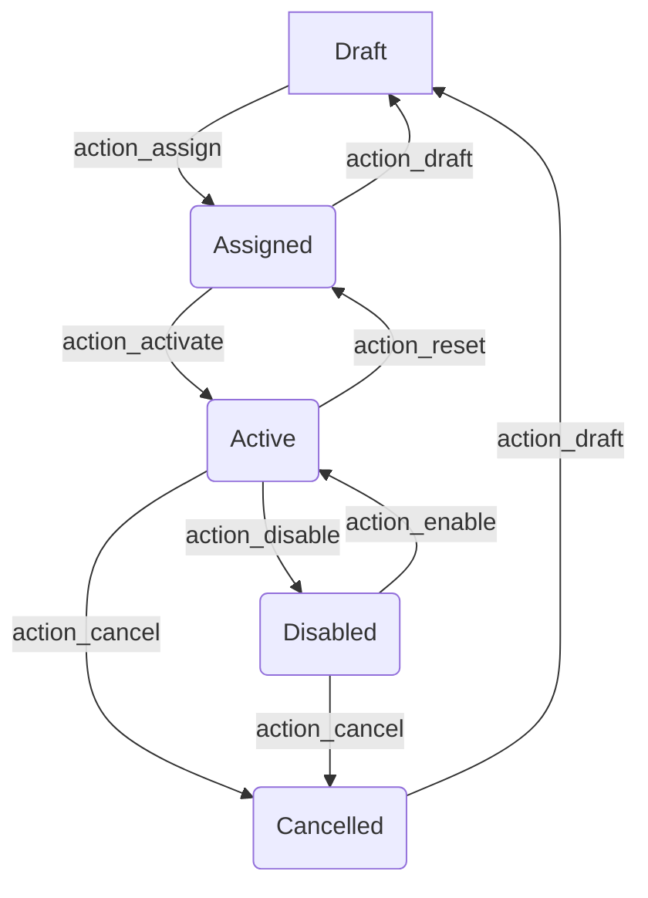

---
tags:
  - Website
type: reference
---

# Mermaid.js

Website: <https://mermaid.js.org/>

Example of state diagram:

```mermaid
flowchart TD
    A[Draft] -->|action_assign| B(Assigned)
    B -->|action_draft| A
    B -->|action_activate| C(Active)
    C -->|action_reset| B
    C -->|action_disable| D(Disabled)
    D -->|action_enable| C
    C -->|action_cancel| E(Cancelled)
    D -->|action_cancel| E
    E -->|action_draft| A
```