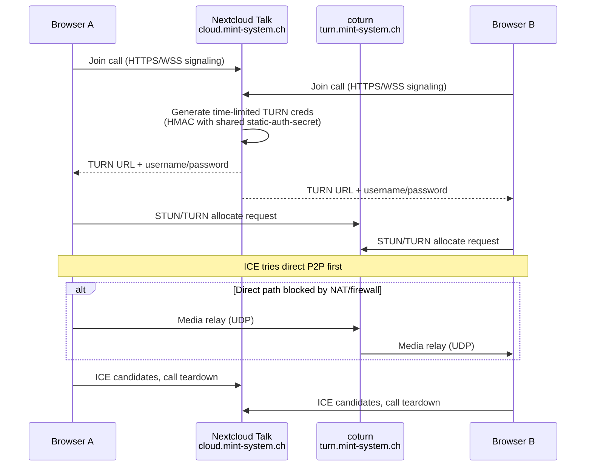

## TURN-Server

Für den effizienten Betrieb braucht es einen TURN-Server wie [[TURN Mint System]].

- **WSS** – WebSocket Secure – verschlüsselte WebSocket-Verbindung für das Signaling (Anrufaufbau, Steuerdaten).
- **STUN** – Session Traversal Utilities for NAT – Server verrät dem Client seine öffentliche IP/Port.
- **TURN** – Traversal Using Relays around NAT – Server leitet Medienverkehr weiter, wenn direkte Verbindung nicht klappt.
- **NAT** – Network Address Translation – Mechanismus, mit dem sich mehrere Geräte eine öffentliche IP teilen.
- **ICE** – Interactive Connectivity Establishment – Verfahren, das die beste Verbindungsmethode zwischen zwei Peers findet.
- **UDP** – User Datagram Protocol – schnelles, verbindungsloses Transportprotokoll für Echtzeit-Medien.