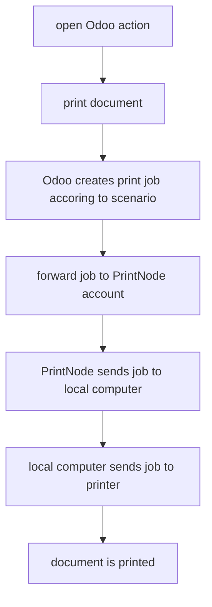

# Odoo Printing

Direkt aus Odoo drucken.

## Evaluation

Welches ist die beste Druckerlösung für Odoo?

### Kandidaten

Die folgenden Kandidaten stehen zur Auswahl:

VentorTech (<https://ventor.tech/solutions/odoo-direct-print/>)
* Odoo 14.0 (<>)
* von Ventor Tech
* kann Versand-Dokumente auf zwei verschiedene Drucker ausgeben.
*  Unterstützt DirectPrint und auch automatisierter Druck (Knopf "Bestätigen" drucken und Dokument wird gleich gedruckt),
*   Unterstützt mehre Druckerfabrikate
*   Kosten: einmalig Euro 199 (<https://apps.odoo.com/apps/modules/14.0/printnode_base/>)

OCA-Programm in GitHub
* Odoo 14.0 (<https://github.com/OCA/report-print-send/tree/14.0/base_report_to_printer>)
* Kostenlos
* mehrere Drucker und innerhalb der Drucker verschiedne Fächer

### Analayse

Entscheidend ist wie lokale Drucker in die off-premise Odoo-Umgebung eingebunden werden können. Bei Ventor wird das mit [PrintNode](https://www.printnode.com/en) ermöglicht.

PrintNode ist ein Programm, das lokal auf dem Computer installiert wird. Es entdeck alle Drucker und synchronisiert mit dem PrintNode-Account. In Odoo verbindet man sich mit dem PrintNode-Account und dadurch stehen Odoo alle Drucker des lokalen Computer zur verfügung. PrintNode ist kostenpflichtig.

Die Abwicklung eines Druckauftrags:

Visualisierung:

![[how does PrintNode work.png]]

<small><https://www.printnode.com/en/docs></small>

Die Lösung von VentorTech kann unter <https://odoo.ventor.tech/> getestet werden.

Die OCA-Lösung sieht vor, dass man [Google Cloud Print](https://www.google.com/cloudprint/learn/) verwendet. Die Integration ist schwieriger als mit PrintNode.

### Empfehlung

Wir empfehlen den Einsatz von **Odoo Direct Print Pro** von VentorTech. Sie haben hervorragende Lösungen zur Integration von Hardware und den Logistikprozessen.