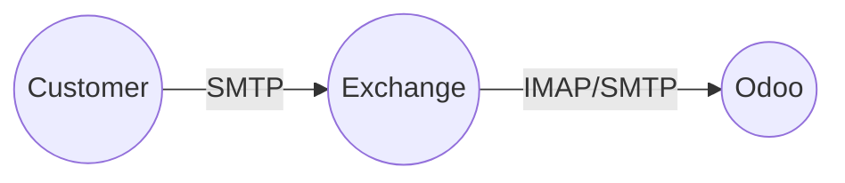

---

---

# Office 365 Exchange für Odoo konfigurieren

Damit Odoo E-Mail mit einem Office 365 Postfach versenden kann, müssen bestimmte Vorbereitungen getroffen werden.

## Relay Server

Odoo verwendet Office 365 Exchange als Relay Server. Dieser muss explizit aktiviert und konfiguriert werden.


- Login unter [https://portal.office.com/adminportal/home](https://portal.office.com/adminportal/home) und öffnen _Admin Center > Exchange_
- Navigation nach _Nachrichtenfluss > Connectors_
- Neuer Connector erfassen und mit _Weiter_ bestätigen

![[Office 365 Connector.png]]

- Als Name _Odoo Connector_ eintragen
- Option _IP-Adresse_ auswählen und die Adresse des Odoo Server eintragen

Die IP-Adresse des Odoo Server können Sie mit diesem Befehl anzeigen:

```bash
nslookup erp.example.com
```

- Mit _Weiter_ und _Speichern_ den Vorgang abschliessen

## Odoo Postfach

Odoo verwendet ein Postfach um E-Mail zu Empfangen und zu versenden



- Login unter [https://portal.office.com/adminportal/home](https://portal.office.com/adminportal/home) und öffnen _Benutzer > Aktive Benutzer_
- Postfach für Odoo erstellen

## Catchall Mail

Odoo kann unter anderen Adressen Mails versenden und Empfangen. Dazu braucht es eine catchall-Adresse.

- Öffnen Office 365 Admin Center
- Naivgation nach _Benutzer > Aktive Benuter > Auswahl Odoo Account_ und mit Rechtsklick _Benutzernamen und E-Mail verwalten_ auswählen
- Die Adresse `catchall@example.com` hinzufügen

## Odoo eingehender Mail-Server

Für den Empfang von Exchange-Mails das folgende IMAP-Postfach konfigureiren:

Servername: `outlook.office365.com`\
Servertyp: IMAP Server\
Port: `993`\
SSL/TLS: `[x]`\
Login information: Bentzername und Passwort des Odoo Postfach

## Odoo ausgehender Mail-Server

Odoo unterscheidet zwischen eingehenden und ausgehen Mails. Für den Versand von Mails muss eine SMTP-Verbindung konfiguriert werden.

- Adresse für Mail-Server anzeigen

```
dig example.ch MX +short
0 example-ch.mail.protection.outlook.com.
```

- Mail-Account mit diesen Informaionen erfassen:

Beschreibung: `Office365 Outgoing`\
Postausgang-Server: `example-ch.mail.protection.outlook.com`\
SMTP-Port: `25`\
Verbindungssicherheit: `Keine`

- Die Verbindung testen und den Vorgang abschliessen
