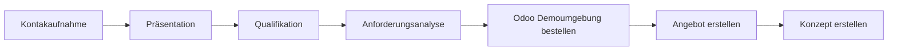

# Prozesse Akquise
Dokumentation der Akquise Prozesse.

Verantwortlich: [[Marco Roeleven]]

* [[Prozesse Akquise - Kontaktaufnahme]]
* [[Prozesse Akquise - Präsentation]]
* [[Prozesse Akquise - Qualifikation]]
* [[Prozesse Akquise - Anforderungsanalyse]]
* [[Prozesse Akquise - Analyse Odoo Customization]]
* [[Prozesse Akquise - Odoo Demoumgebung erstellen]]
* [[Prozesse Akquise - Angebot erstellen]]
* [[Prozesse Akquise - Konzept erstellen]]