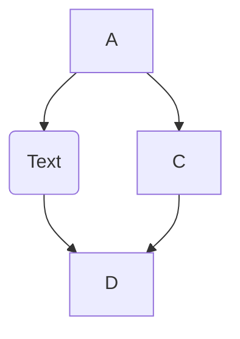
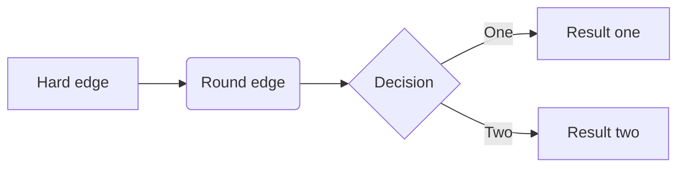

# Referenzsystem Odoo

## Prozesse

### Produktionsplanung

### Produktion

### Einkauf

![[Prozess Einkauf]]

|Flow   |     Beschreibung      |  Hilfsmittel|
|----------|:-------------:|------:|
|![[Aufgabe.png]] | | |
|![[Aufgabe.png]] | | |
|![[Aufgabe.png]] | | |

* [[Odoo Handbuch#Angebot erstellen|Angebotsanfrage erstellen]]
* [[Odoo Handbuch#Produkt erstellen|Einkaufprodukte definieren]]

### Lieferantenbeurteilung

### Wareneingang

### Versand

### Feststellungen

### Personal Administration

### Budget

### Buchhaltung

### Kostenrechnung

### Lohnabrechnung