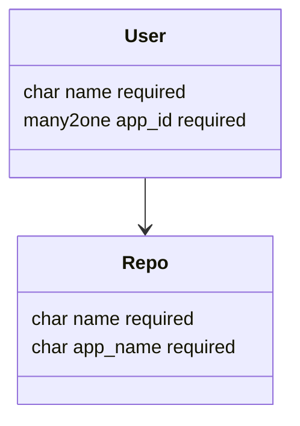

# Specification Git Kubernetes

Context: Odoo shop for mint-cloud.ch

Goal: Create a git branch for every Kubernetes app / environment.

Repo: <https://github.com/Mint-System/Odoo-Apps-Connector>\
Version: 18

## Modules

### Git Base

Name: `git_base`\
depends: `base`\
models:

description:

Uses GitPython <https://pypi.org/project/GitPython/> to manager git repositories and its branches.

branches:
- prod: production
- int: integration
- test: testing
- dev: development
- upg: upgrade

### Git Kubernetes

Name: `git_kubernetes`\
depends: `git_base,kubernetes_base`

description:

When a new app is added for every environment a branch is created in a git repo.