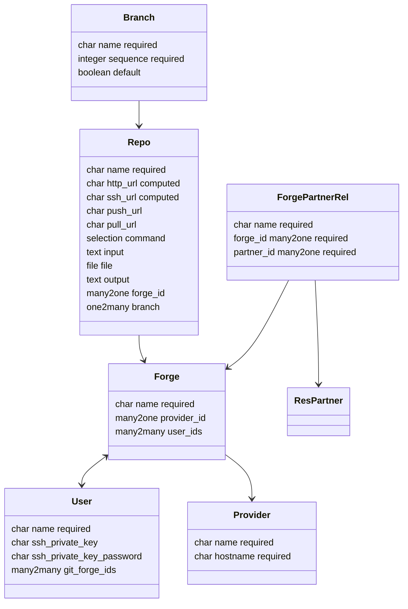

# Specification Git Kubernetes

Context: Odoo shop for mint-cloud.ch

Goal: Create a git branch for every Kubernetes app / environment.

Repo: <https://github.com/Mint-System/Odoo-Apps-Connector>\
Version: 18

## Modules

### Git Base

Name: `git_base`\
depends: `base`\
models:



description:

Runs git commands in the home folder of Odoo. The ssh key is stored in the Odoo user entry. On every operation it is written as a temporary file.

```python
Repo.clone_from(url, repo_dir, env={"GIT_SSH_COMMAND": 'ssh -i /PATH/TO/KEY'})
```

![[Git Base Repo UI.excalidraw]]

Forge Provider:
* GitHub: github.com
* GitLab: gitlab.com
* Gitea: gitea.com
* Codeberg: codeberg.org
* Codey: codey.ch

Commands:
* git status
* git log
* git add .
* git clean -df
* git commit -m "$1"

Branches:
- prod: production
- int: integration
- test: testing
- dev: development
- upg: upgrade

### Git Kubernetes

Name: `git_kubernetes`\
depends: `git_base,kubernetes_base`

description:

When a new app is added for every environment a branch is created in a git repo.
