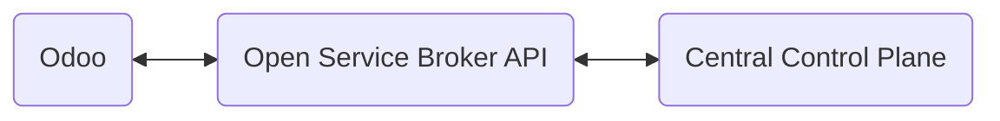

---
tags:
  - Specification
lang: en
draft: true
kind:
  - explain
section: specification
---
# Specification Uri Cloud

The Uri Cloud is communication to the [[VSHN Central Control Plane]] using the [[Open Service Broker API]].

The interface to the Uri Cloud is an Odoo webshop. Visitors can be buy hostings from the application catalog.



To make this work, two things are required: Appcat Definition for Odoo and an Open Service Broker Integration.
## Appcat Odoo

```yaml
apiVersion: vshn.appcat.vshn.io/v1
kind: VSHNOdoo
metadata:
  name: acme
  namespace: company-1
spec:
  parameters:
    service:
      majorVersion: "18"
    size:
      plan: plus-4
    backup:
      schedule: "30 23 * * *"
      retention: 12
  writeConnectionSecretToRef:
    name: odoo-creds
```

## Open Service Broker Integration

Users buy hosting subscriptions in the webshop. When a subscription is confirmed Odoo should call the Open Service Broker (OSB) API and submit the name of the organisation / project and the service.

The Odoo integration requires three modules:

 1. [[Specification Open Service Broker Client]] Client to communicate with Open Service Broker API.
 2. [[Specification Website Sale Open Service Broker]] Setup an OSB organisation in the checkout process.
 3. [[Specification Subscription OCA Open Service Broker]] Manage lifecycle of OSB service with subscription.