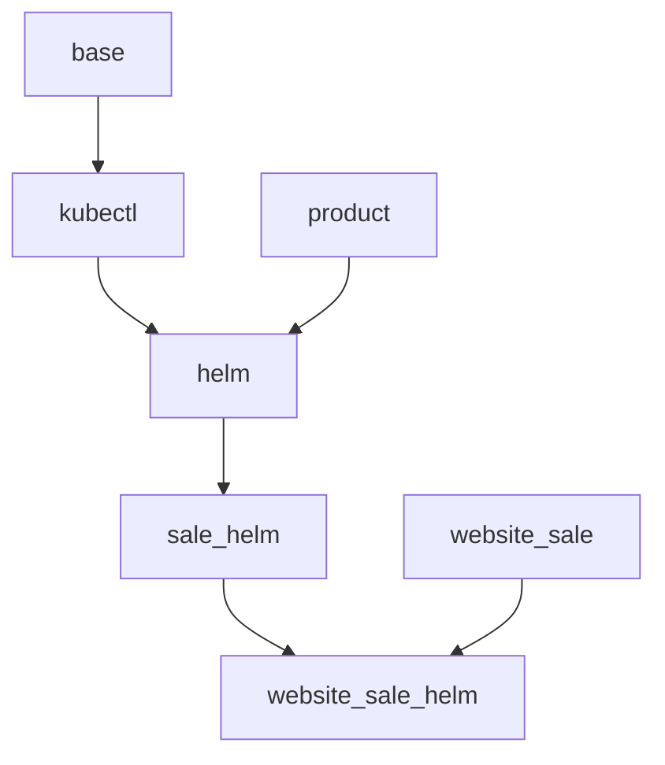

# Specification Website Sale Helm

## Module structure

## Object model

![[Specification Sale Helm.excalidraw]]

## Odoo models

The most important models and fields.

## Kubectl Context

Name: `kubectl.context`

- `cluster_id` Kubeconfig connects to this cluster.
- `config` Content of the kubeconfig.

## Kubectl Cluster

Name: `kubectl.cluster`

- `server`: Hostname of Kubernetes cluster.
- `povider_id`: Link the Hosting provider.
- `context_ids`: Connected kubeconfigs.

Kubectl Namespace

Name: `kubectl.namespace`

- `cluster_id` The namespace belongs to a cluster.

## Helm Chart

Name: `helm.chart`

- `name`: Name of the chart.
- `values`: Content of the `values.yaml`.
- `value_ids`: Links Helm chart values.

## Helm Release

Name: `chart.release`

- `namespace_id`: Namespace the release is connected to.
- `chart_id`: Links the chart.
- `values`: Content of customer specific `values.yaml`

Once a release is installed, the admin can edit the `values` and upgrade the release. For the customer portal there will be explicit fields and validations to change the content of `vaules`.

The admin can download the `manifest.yaml` and `values.yaml`.

### Helm Chart Value

Name: `helm.chart.value`

- `chart_id`: References the helm chart .
- `path`: Path expression of the value key.
- `value`: Python expression that defines the value. Has access to `sale_id` and `chart_id`.
- `field_id`: Instead of applied to a `values.yaml` the value is applied to a release field.

The chart values are evaluated once.
