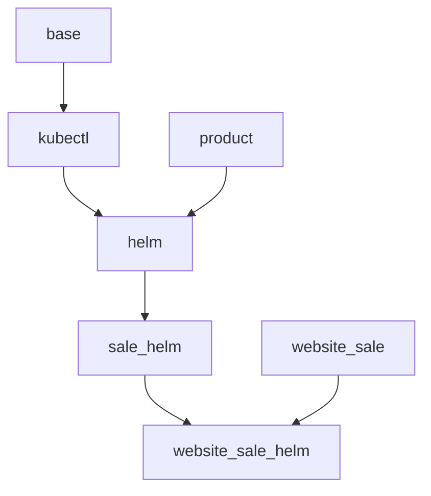

---
tags:
  - Specification
lang: en
---
# Specification Website Sale Helm

The module structure:

```mermaid
graph TD
  base --> kubectl
  kubectl --> helm
  product --> helm
  helm --> sale_helm
  sale_helm --> website_sale_helm
  website_sale --> website_sale_helm
```

The object model:

![[Specification Sale Helm.excalidraw]]