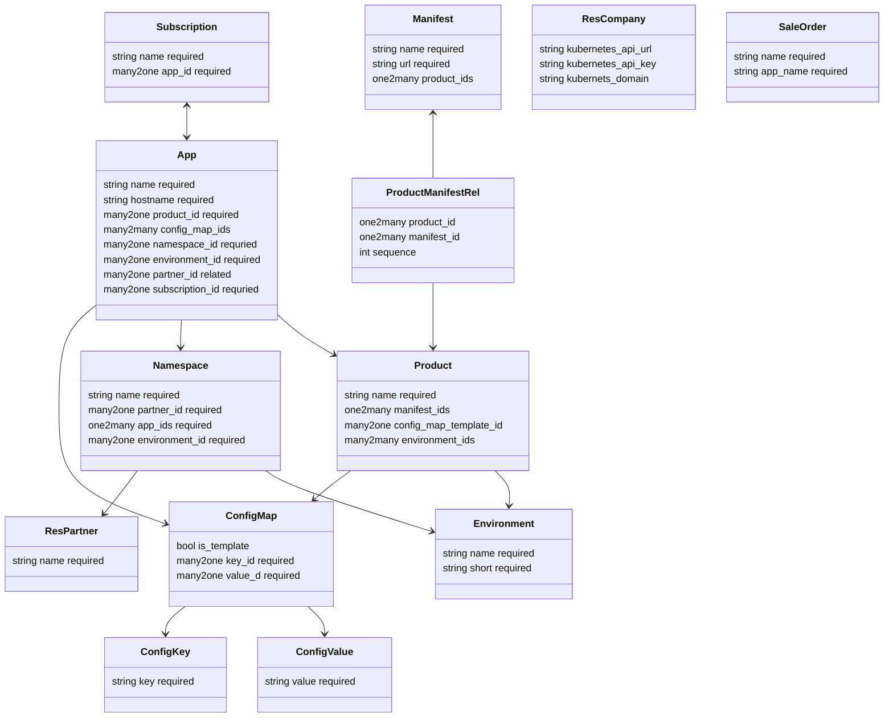

# Specification Website Sale Kubernetes Subscription OCA

Context: Odoo shop for mint-cloud.ch

Goal: Extend website sale module so registered users can buy an Odoo App subscription that is automatically deployed to Kubernetes.

Repo: Mint-System/Vertical-SaaS\
Version: 18\
Edition: CE

## Modules

### Kubernetes Base

Name: `kubernetes_base`\
depends: product\
models:

description:

Add <https://github.com/kubernetes-client/python>
Setup connection to Kubernetes cluster.
Define deployment and service manifests.
Setup product tab to select manifests.
Manage app domains.

kubernetes.config.map:
	environment
		- prod: production
		- int: integration
		- test: testing
		- dev: development
		- upg: upgrade

kubernetes.app:

- name r4ts-int
- hostname: r4ts-int.mint-cloud.ch
- config_map_ids:
	- ENVIRONMENT: prod
	- REVISION: 17.0.20241104
	- GIT_REPOS: <git@github.com/oca/sale-workflow#16>,<git@github.com/oca/sale-workflow#17>
	- PIP_INSTALL: fastapi

### Kubernetes Portal

Name: `kubernetes_portal`\
depends: kubernetes_base, portal 

description:

Add portal views to manage the Kubernetes app.

### Subscription OCA Portal

Name: `subscription_oca_portal`\
depends: subscription_oca, portal\

description:

Basic portal view for oca subscriptions.

### Website Sale Kubernetes Subscription OCA

Name: `website_sale_kubernetes_subscription_oca`\
depends: website_sale, kubernetes_base, subscription_oca

description:

User can enter app name in checkout process.
The (subscription) product is deployed to the Kubernetes cluster.
An invitation mail with the credentials is sent to the customer.