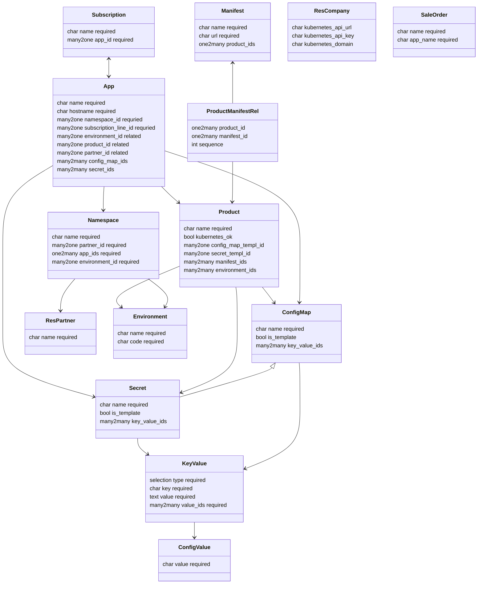

# Specification Website Sale Kubernetes Subscription OCA

Context: Odoo shop for mint-cloud.ch

Goal: Extend website sale module so registered users can buy an Odoo App subscription that is automatically deployed to Kubernetes.

Repo: <https://github.com/Mint-System/Odoo-Apps-Vertical-SaaS>\
Version: 18

## Modules

### Kubernetes Base

Name: `kubernetes_base`\
depends: `product`\
models:

description:

Add <https://github.com/kubernetes-client/python>.
Setup connection to Kubernetes cluster.
Define deployment and service manifests.
Setup product tab to select manifests.
Manage config maps and apps.
Applies the config map key values to the manifest files.

environments:
- prod: production
- int: integration
- test: testing
- dev: development
- upg: upgrade

kubernetes.app:

- name r4ts-int
- hostname: r4ts-int.mint-cloud.ch
- config_map_ids:
	- KUBERNETES_ENVIRONMENT: int
	- KUBERNETES_IMAGE: mintsystem:odoo-17.0.20241104
	- KUBERNETES_GIT_REPOS: git@github.com/mint-cloud/r4ts.git
	- KUBERNETES_PIP_INSTALL: fastapi

Products:
- Odoo Community Edition
- Odoo Enterprise Edition

### Kubernetes Portal

Name: `kubernetes_portal`\
depends: `kubernetes_base,portal`

description:

Add portal views to manage the Kubernetes app.

### Subscription OCA Portal

Name: `subscription_oca_portal`\
depends: `subscription_oca,portal`\

description:

Basic portal view for oca subscriptions.

### Website Sale Kubernetes Subscription OCA

Name: `website_sale_kubernetes_subscription_oca`\
depends: `website_sale,kubernetes_base,subscription_oca`

description:

User can enter app name in checkout process.
The (subscription) product is deployed to the Kubernetes cluster.
An invitation mail with the credentials is sent to the customer.