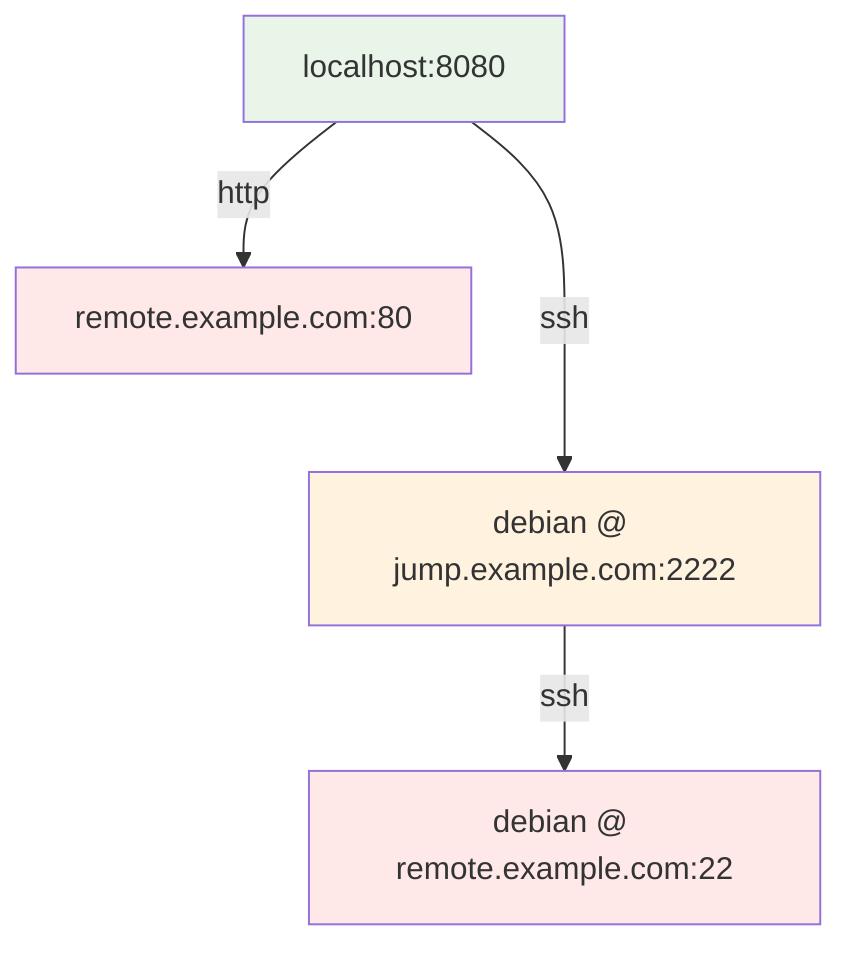
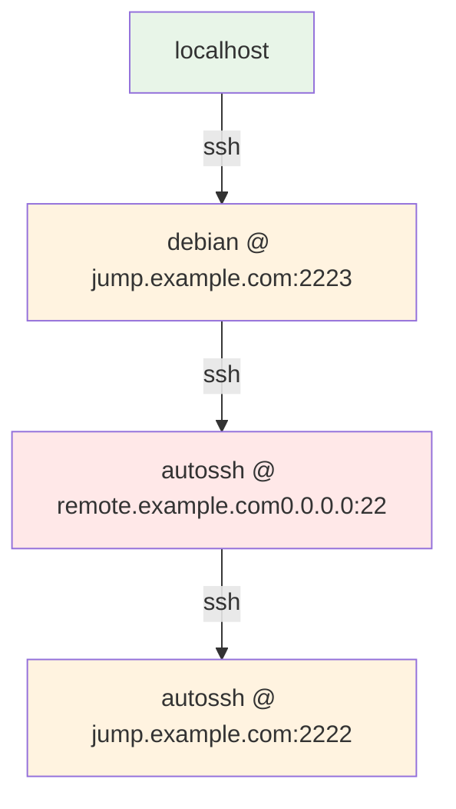

---
tags:
  - Website
kind:
  - explain
---
# autossh

Website: <https://linux.die.net/man/1/autossh>

## Forward SSH Tunnel

```yml
local_user="debian"
local_key_file="/home/debian/.ssh/id_ed25519"
local_interface="0.0.0.0"
local_port="8080"
ssh_user="debian"
ssh_server="jump.example.com"
ssh_port="2222"
remote_server="remote.example.com"
remote_port="80"
```



## Reverse SSH Tunnel

```yml
local_user="autossh"
local_key_file="/home/autossh/.ssh/id_ed25519"
local_interface="0.0.0.0"
local_port="22"
ssh_user="debian"
ssh_server="jump.example.com"
ssh_port="2222"
remote_server="localhost"
remote_port="2223"
```

