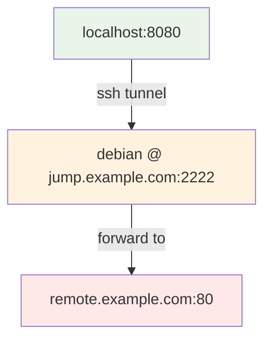
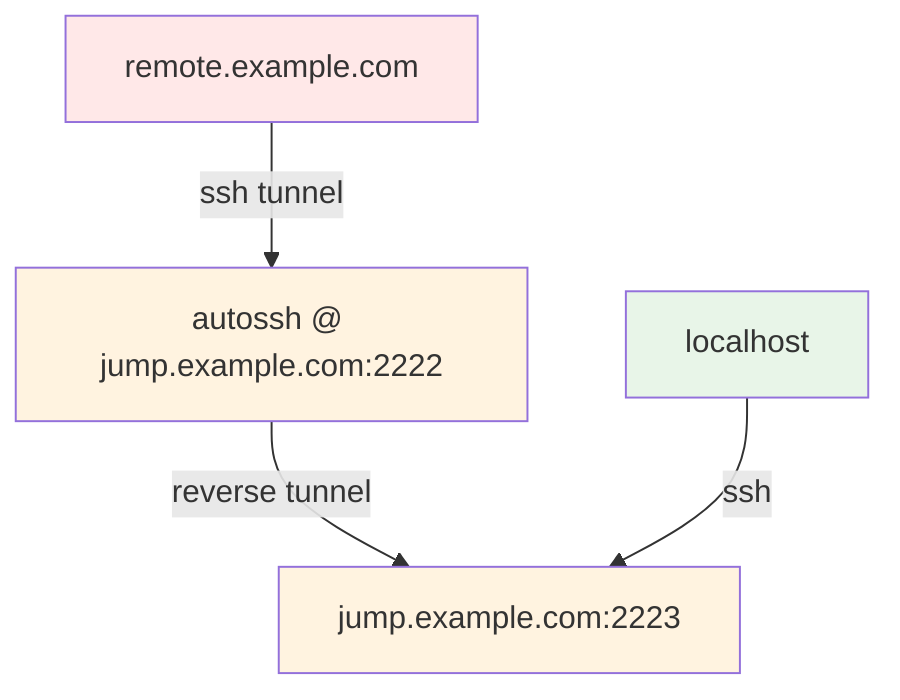

---
tags:
  - Website
kind:
  - explain
lang: en
section: infrastructure
---

# autossh

Website: [https://linux.die.net/man/1/autossh](https://linux.die.net/man/1/autossh)

## Ansible role

Use [[Ansible Build]] to setup an autossh tunnel.

Link: <https://ansible.build/roles/autossh/>

Here are some examples.

### Forward SSH Tunnel with Jumphost

For localhost setup:

```yml
local_user: 'debian'
local_key_file: '/home/debian/.ssh/id_ed25519'
local_interface: '0.0.0.0'
local_port: '8080'
ssh_user: 'debian'
ssh_server: 'jump.example.com'
remote_ssh_port: '2222'
remote_server: 'remote.example.com'
remote_port: '80'
```



## Reverse SSH Tunnel with Jumphost

For remote server setup:

```yml
local_user: 'autossh'
local_key_file: '/home/autossh/.ssh/id_ed25519'
local_interface: 'localhost'
local_port: '22'
ssh_user: 'autossh'
ssh_server: 'jump.example.com'
remote_ssh_port: '2222'
remote_server: '0.0.0.0'
remote_port: '2223'
```


